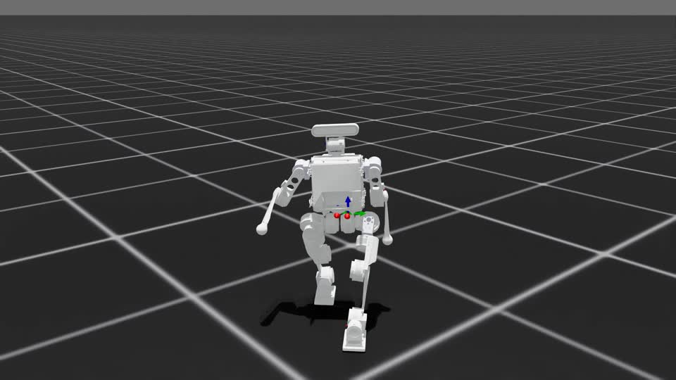
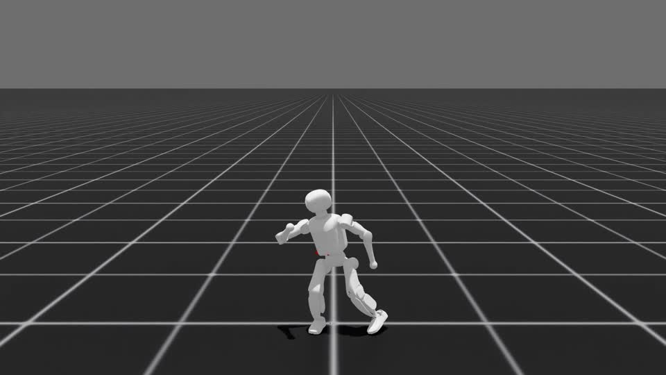

# Whole-Body Motion Retargeting

**MOS walking and Booster K1 motion tracking**: human-to-robot retargeting with
GMR, robot-reference conversion, and Isaac Lab reinforcement learning.

By **MAAROUF MOHAMED**.

**Asset permissions:** the maintainer confirmed public redistribution permission
on September 20, 2026. See [NOTICE](NOTICE.md) for provenance and upstream terms.

| MOS rigid-torso walking | Booster K1 dance |
| --- | --- |
| [](media/mos_walk_front_uhd_20s.mp4) | [](media/k1_dance_front_uhd.mp4) |
| Front view, UHD, approximately 20 seconds | Front view, UHD, approximately 10 seconds |

Click a thumbnail to open its video. These are simulation demonstrations,
not hardware validation.

## Start Here

```bash
git clone https://github.com/THU-MAHUA/whole-body-motion-retargeting.git
cd whole-body-motion-retargeting
```

Use two independent environments: Python 3.10 for GMR and Python 3.11 for
Isaac Sim / Isaac Lab. Root-level `pip install -e .` installs this project's
Python packages; extras install workflow dependencies. GPU drivers and Isaac
runtime setup are separate prerequisites.

- [Installation and tested environments](docs/installation.md)
- [Preview, convert, train, resume, and record](docs/workflows.md)
- [MOS walking corrections and remaining limitations](docs/mos-walking.md)
- [Motion catalog and provenance](motions/README.md)
- [Validation results](docs/validation.md)

The repository includes generated robot references, two selected RL
checkpoints, and the robot assets needed to use them. No AMASS, ACCAD, CMU,
human-source clips, or SMPL-X body-model weights are bundled.
New human-to-robot retargeting requires your own authorized human recordings
and body-model weights. Training the included references does not.

## Project Layout

```text
src/           GMR, Booster Train, Booster Assets, and shared resource paths
retargeting/   Retargeting entrypoints, MOS tools, and kinematic tests
training/      Conversion, reference replay, PPO training, and policy playback
robots/        MOS and K1 source, MuJoCo, and Isaac training assets
motions/       Generated GMR references, Isaac NPZs, and historical comparisons
checkpoints/   Selected K1 dance and MOS rigid-v2 policies and configurations
media/         Demo videos and poster images
environments/ Tested dependency constraints
docs/          Installation, workflows, provenance, and validation
```

## Acknowledgments

- **[GMR by Yanjie Ze and contributors](https://github.com/YanjieZe/GMR)**:
  the general motion-retargeting framework underlying this project.
- **[Booster Train by Booster Robotics](https://github.com/BoosterRobotics/booster_train)**:
  the Isaac Lab motion-tracking and reinforcement-learning foundation.
- [Booster Assets](https://github.com/BoosterRobotics/booster_assets),
  [Isaac Lab](https://github.com/isaac-sim/IsaacLab), and
  [Whole-Body Tracking](https://github.com/HybridRobotics/whole_body_tracking)
  provide robot assets, simulation infrastructure, and tracking foundations.

Please acknowledge and cite the upstream projects when building on this work.
See [NOTICE.md](NOTICE.md) and [LICENSES](LICENSES) for retained upstream notices.
No new blanket license is granted for original contributions. Public visibility
does not override the rights or terms attached to upstream code, models, or data.

## Research Limits

The policies track individual short clips, not speed commands or seamless
periodic gaits. MOS actuator parameters are provisional. Flat-foot and
rigid-torso adjustments improve reference geometry but do not establish
dynamic stability or sim-to-real readiness. The virtual-waist comparison is
a separate kinematic experiment and must not be used to train the real MOS.
